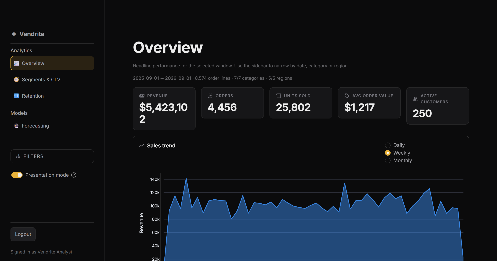
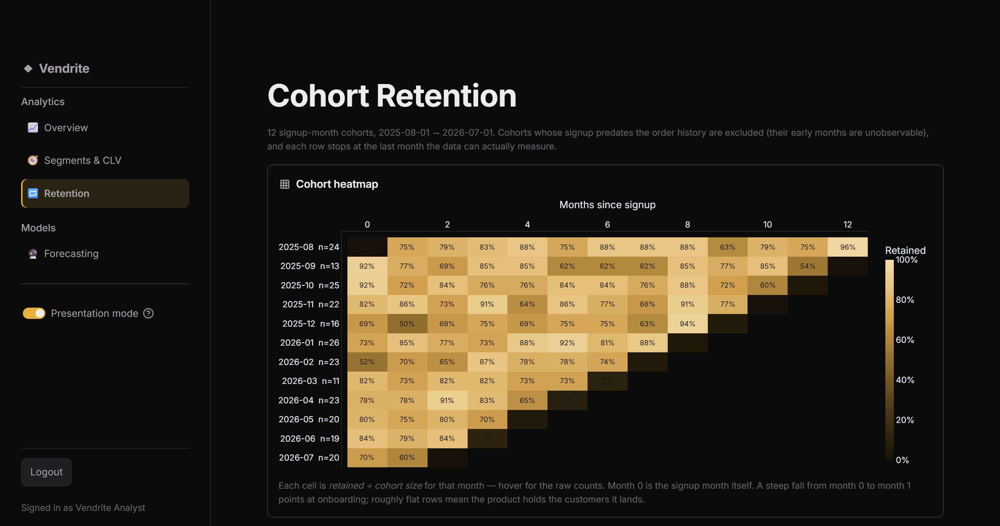
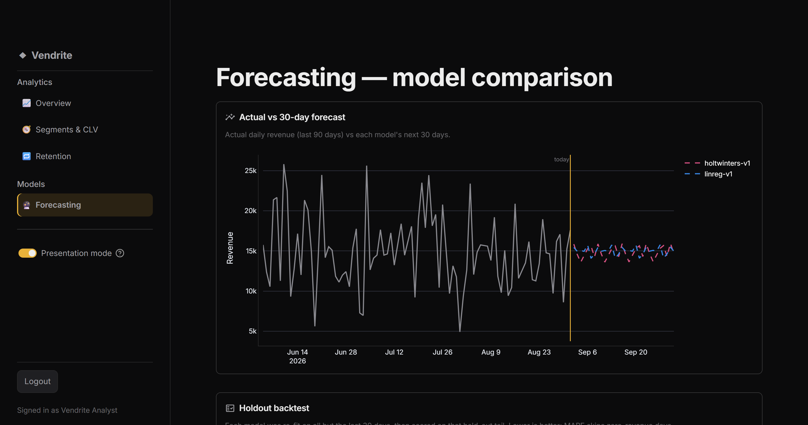
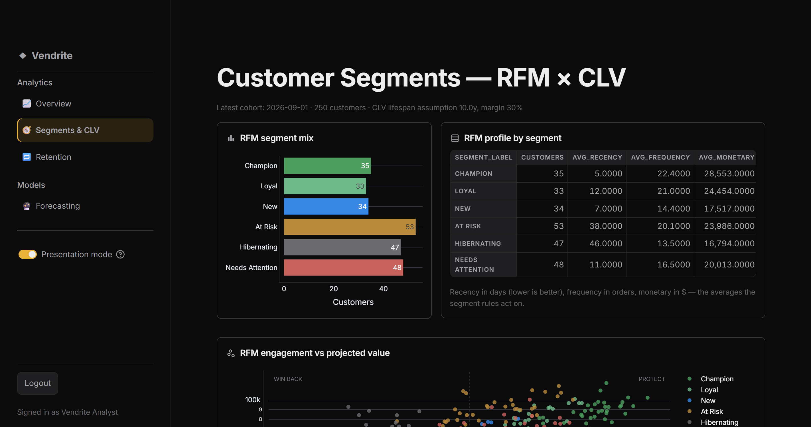
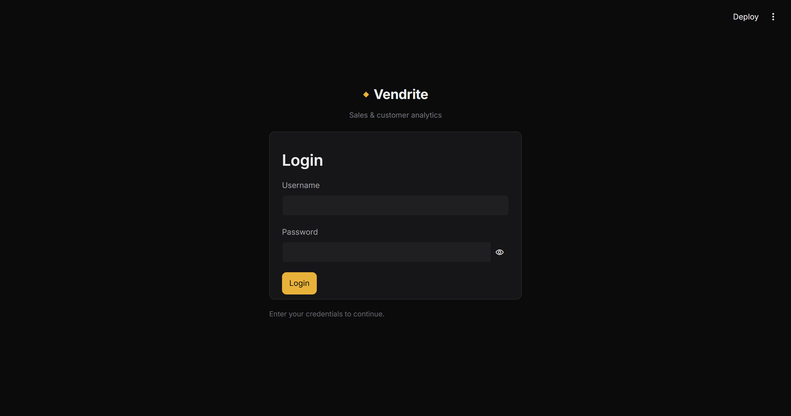

# Vendrite

E-commerce sales & customer analytics platform — an ETL pipeline, RFM customer
segmentation, and short-term demand forecasting, surfaced through an interactive
Streamlit + Plotly dashboard, backed by a PostgreSQL star-schema warehouse.

**[▶ Live demo](https://vendrite-cpb2h62yhhjy52pzvoutbd.streamlit.app/)** — hosted
on Streamlit Community Cloud. The app is behind a credential login gate, so you
will need the demo username/password to get past the sign-in screen; the
screenshots below show what's inside.

> **Status:** feature-complete and Neon-verified end to end — ETL → PostgreSQL
> star schema, RFM segmentation, heuristic CLV, signup-month cohort retention,
> two forecast models (linear regression + Holt-Winters) with a holdout
> backtest, a four-page dark-themed Streamlit/Plotly dashboard behind a login
> gate, a scheduled GitHub Actions pipeline + templated run report, and a
> 75-test pytest suite. See [Known limitations](#known-limitations).

## Screenshots

**Overview** — headline KPIs with period-over-period deltas, and a revenue trend
with a switchable daily/weekly/monthly grain.



**Cohort retention** — signup-month cohorts as a triangular heatmap. Rows read
left-to-right as one cohort decaying; columns read top-to-bottom as whether newer
cohorts hold up better. Cell hover gives the raw `N of M customers`.



**Forecasting** — both models over the same horizon against actuals, split by the
gold "today" divider, with the holdout backtest that scored them below.



<details>
<summary>Segments &amp; CLV, and the login gate</summary>




</details>

---

## Architecture overview

```
                 ┌─────────────────────────┐
 raw CSV  ──────▶│ etl/extract.py          │  read + schema/format validation
 (mock or real)  │  → valid rows            │  malformed rows → data/processed/
                 │  → quarantine (reason)   │      quarantine_extract.csv
                 └───────────┬─────────────┘
                             ▼
                 ┌─────────────────────────┐
                 │ etl/load.py             │  parameterized SQLAlchemy Core
                 │  load_to_staging()      │  ── writes ▶ staging.raw_transactions
                 └───────────┬─────────────┘
                             ▼  read_staging()
                 ┌─────────────────────────┐
                 │ etl/clean.py (pure)     │  dedupe · impute · coerce types ·
                 │  transform()            │  map → star schema
                 │  → dim_* / fact_sales   │  invalid rows → quarantine_transform.csv
                 └───────────┬─────────────┘
                             ▼  upsert / insert (ON CONFLICT = idempotent)
                 ┌───────────────────────────────────────────────────────────┐
                 │ analytics schema (PostgreSQL star schema)                  │
                 │   dim_customer   dim_product   dim_date                    │
                 │              ╲       │       ╱                             │
                 │                 fact_sales                                 │
                 │   etl_run_log  ◀── every run logs STARTED/SUCCESS/FAILED   │
                 └───────────┬───────────────────────────────────────────────┘
                             ▼  write role (vendrite_etl)
   ┌─────────────────────────────────────────────────────────────────────────┐
   │ analytics/  — each module reads fact_sales and appends its own result    │
   │   segmentation.py  RFM scoring + 6 labels  ─▶ analytics.customer_segments│
   │   clv.py           heuristic CLV            ─▶ analytics.customer_clv    │
   │   cohorts.py       signup-month retention   ─▶ analytics.cohort_retention│
   │   forecasting.py   TWO models + backtest    ─▶ analytics.sales_forecast  │
   │                    linreg-v1 · holtwinters-v1  analytics.forecast_backtest│
   └─────────────────────────┬───────────────────────────────────────────────┘
                             ▼  read-only role (vendrite_dashboard)
   ┌─────────────────────────────────────────────────────────────────────────┐
   │ dashboard/ — Streamlit + Plotly, four pages behind a login gate          │
   │   app.py router → auth.py gate → st.navigation                          │
   │     Overview  ·  Segments & CLV  ·  Retention  ·  Forecasting            │
   │   data.py (cached SQL reads) · transforms.py (pure reshaping) ·          │
   │   theme.py (every colour/font token + the Plotly dark template)          │
   └─────────────────────────────────────────────────────────────────────────┘
```

The dashboard computes **nothing**. Every number it draws was written to the
`analytics` schema by a pipeline run, so a page load is a `SELECT` and a reshape.
That is what lets it connect as a role with `SELECT`-only rights.

**Separation of concerns** — ingestion (`extract`), transformation (`clean`,
pure/no-I/O), persistence (`load`, the only DB module), analytics (`analytics/`),
and presentation (`dashboard/`) never share a file. All configuration
(paths, DB params, tunables) lives in `config/settings.py`, loaded from
environment variables.

### Project layout

| Path | Purpose |
| ---- | ------- |
| `data/raw/`, `data/processed/` | generated raw CSV / intermediate + quarantine files (gitignored) |
| `etl/` | `generate_mock_data`, `extract`, `clean`, `load`, `run_etl` |
| `sql/schema/` | numbered DDL + role setup (see `sql/schema/README.md`) |
| `sql/queries/` | verification / analysis SQL |
| `analytics/` | `segmentation.py` (RFM), `clv.py`, `cohorts.py`, `forecasting.py` (two models + backtest) |
| `dashboard/` | four-page Streamlit app — `app.py` (entry/router), `auth.py`, `data.py`, `transforms.py`, `theme.py`, `views/{overview,segments,retention,forecasting_view}.py` |
| `docs/screenshots/` | dashboard screenshots used by this README |
| `reporting/` | `generate_report.py` + Jinja2 `templates/` — run-summary report |
| `reports/` | generated summary report artifacts, gitignored |
| `run_pipeline.py` | one-command orchestrator: ETL → segmentation → CLV → cohorts → forecast → report |
| `config/settings.py` | central configuration, env-driven |
| `tests/` | 75-test pytest suite — `test_clean.py`, `test_segmentation.py`, `test_forecasting.py`, `test_clv.py`, `test_cohorts.py`, `test_dashboard_transforms.py`, `test_dashboard_app.py` (headless `AppTest` render + auth-flow guards) |
| `.github/workflows/pipeline.yml` | scheduled ETL→analytics→report pipeline |
| `.github/workflows/tests.yml` | run `pytest` on every push / PR |

---

## Setup

### 1. Python environment

Requires **Python 3.11+** (built/tested on CPython 3.14).

```bash
python -m venv .venv
# Windows PowerShell:
.venv\Scripts\Activate.ps1
# macOS/Linux:
source .venv/bin/activate

pip install -r requirements.txt
```

### 2. Configuration

```bash
cp .env.example .env
```

Edit `.env` and set real values (the file is gitignored — never commit it).
In CI these same keys come from **GitHub Actions Secrets**.

### 3. PostgreSQL

Assumes a reachable PostgreSQL server and a database named `vendrite`
(pgAdmin is used externally for admin — no app code touches it).

```bash
createdb -h localhost -U postgres vendrite

# apply every DDL file in order — 01 → 06
for f in sql/schema/0*.sql; do
  psql -h localhost -U postgres -d vendrite -v ON_ERROR_STOP=1 -f "$f"
done
```

The files are additive and must run in order:

| File | Creates |
| ---- | ------- |
| `01_schemas.sql` | the `staging` and `analytics` schemas |
| `02_roles.sql` | `vendrite_etl` (read/write) and `vendrite_dashboard` (read-only) |
| `03_staging.sql` | `staging.raw_transactions` |
| `04_analytics.sql` | star schema + `customer_segments`, `sales_forecast`, `etl_run_log` |
| `05_clv_cohorts.sql` | `customer_clv`, `cohort_retention` |
| `06_forecast_backtest.sql` | `forecast_backtest` |

`02_roles.sql` creates the two roles with **placeholder passwords** — change
them immediately and put the same values in `.env`:

```sql
ALTER ROLE vendrite_etl       WITH PASSWORD '...';
ALTER ROLE vendrite_dashboard WITH PASSWORD '...';
```

| Role | Access | Used by |
| ---- | ------ | ------- |
| `vendrite_etl` | read/write on `staging` + `analytics` | ETL & analytics jobs |
| `vendrite_dashboard` | **read-only on `analytics` only** | Streamlit dashboard |

Full details and the pgAdmin path: [`sql/schema/README.md`](sql/schema/README.md).

### 4. Populate and run

```bash
# generate mock data and run all six stages:
# ETL → RFM → CLV → cohorts → forecasts + backtest → report
python run_pipeline.py --generate

# then launch the dashboard (login gate uses the VENDRITE_AUTH_* values in .env)
streamlit run dashboard/app.py
```

No PostgreSQL to hand? `python -m etl.run_etl --offline --generate` runs
generate → extract → clean and writes the star-schema frames to
`data/processed/` as CSVs. The analytics modules and dashboard still need a
database.

---

## Running the pipeline locally

```bash
# Full pipeline against PostgreSQL: (re)generate mock data → extract → stage →
# transform → load star schema → log to analytics.etl_run_log
python -m etl.run_etl --generate

# Same, but reuse the existing raw CSV
python -m etl.run_etl

# DB-free dev/inspection: generate → extract → clean, writing the star-schema
# frames as CSVs to data/processed/ (no PostgreSQL needed)
python -m etl.run_etl --offline --generate
```

Individual stages are runnable too: `python -m etl.generate_mock_data`,
`python -m etl.extract`.

### Verifying the warehouse

After a full run, check the warehouse directly (psql or pgAdmin):

```bash
psql -h localhost -U vendrite_etl -d vendrite -f sql/queries/phase1_verification.sql
```

Expect: `staging.raw_transactions` populated; `dim_customer` / `dim_product` /
`dim_date` / `fact_sales` non-empty; zero orphan FKs; zero rows with
`quantity <= 0` or `total_amount <= 0`; a `SUCCESS` row in `etl_run_log`.

---

## Analytics layer

Run after the ETL has populated `analytics.fact_sales`:

```bash
# RFM segmentation → appends one row per customer to analytics.customer_segments
python -m analytics.segmentation

# Heuristic CLV → appends one row per customer to analytics.customer_clv
python -m analytics.clv

# Signup-month cohort retention → upserts the grid into analytics.cohort_retention
python -m analytics.cohorts

# Daily-revenue forecast — runs BOTH models (linreg-v1, holtwinters-v1),
# appends N days each to analytics.sales_forecast, and backtests them
python -m analytics.forecasting
```

**Segmentation** — recency (days since last order), frequency (distinct orders),
monetary (total spend) per customer, each scored into 1–5 quintiles, then a
first-match rule table assigns one of: `Champion`, `Loyal`, `New`, `At Risk`,
`Hibernating`, `Needs Attention`. `customer_segments` is **append-only** — each
run adds a new `computed_date` cohort so segment history is preserved.

**Customer Lifetime Value** (`analytics/clv.py`) — a deliberately simple,
hand-checkable formula, **not** a black-box model:

```
CLV_i = AOV_i × f_i × L × m
```

| Term | Meaning | How it's derived |
| --- | --- | --- |
| `AOV_i` | average order value | customer's `monetary / frequency` (their own mean spend per distinct order) |
| `f_i` | annualised purchase frequency | `frequency / (tenure_days / 365.25)`, `tenure_days` floored at `VENDRITE_CLV_MIN_TENURE_DAYS` (30) so a days-old customer doesn't divide by ~0 |
| `L` | expected lifespan (years) | one global estimate = `1 / churn_rate`, where `churn_rate` = share of customers with recency > `VENDRITE_CLV_CHURN_DAYS` (90); clamped to `[VENDRITE_CLV_LIFESPAN_MIN_YEARS, …MAX_YEARS]` = `[1, 10]` because a ~12-month window can't support wider estimates |
| `m` | gross margin | flat assumption `VENDRITE_CLV_GROSS_MARGIN` = `0.30` — the source has no COGS, so CLV is profit-based under this one documented constant |

`customer_clv` stores every component, not just `predicted_clv`, so the number
is auditable. **Deliberate simplifications** (interview material): historical /
heuristic rather than predictive (no BG/NBD churn model), and no discounting of
future cash flows — both are natural extensions, left out so every term stays
verifiable by hand. Customers with no `signup_date` are dropped and logged.

**Known degeneracy of a single average lifespan:** when the base churn rate is
very low, `1/churn_rate` exceeds the 10-year clamp and `L` pins to the cap for
*every* customer — so `L` stops differentiating and CLV ranking collapses to
`AOV × annualised frequency`. On the bundled synthetic data churn is ~1–2%, so
this is exactly what happens; `clv.run()` logs `base_churn_rate` and a
`lifespan_clamped` flag so it's never silent. It's the textbook formula
behaving correctly — the fix on real data is genuine lapsed customers, or a
per-customer residual-lifetime model. Even with `L` constant, CLV ≠ RFM: the
frequency term is *annualised*, so CLV rewards recent purchase **velocity**
where RFM's monetary score rewards **cumulative** spend — which is why *high
RFM + low CLV* (big historical spender, slowing) reads differently from *high
RFM + high CLV* (big spender, still fast).

**Cohort retention** (`analytics/cohorts.py`) — customers grouped by
`signup_date` month; for each cohort, the share still purchasing 0, 1, 2, …
months later. Only **data-observable** cells are written:

- the **tail** is trimmed — a cohort that signed up 3 months before the latest
  order gets `months_since_signup` 0–3, never 0–`VENDRITE_COHORT_MAX_MONTHS`,
  so recent cohorts don't show a fake cliff;
- a whole cohort is **dropped** when its signup month is more than
  `VENDRITE_COHORT_SIGNUP_GRACE_MONTHS` before the earliest order — every cell
  would otherwise be a structural zero. (On the bundled synthetic data, signup
  dates span ~3 years but orders span 12 months, so this drops the pre-window
  cohorts; the kept cohorts are small — ~7 customers each — because signups are
  spread thin. Tightening the mock generator's signup range is the fix for
  fuller curves.)

Orders predating a customer's signup (negative offset) are ignored. Each run
**replaces that `computed_date`'s rows** (delete + insert in one transaction)
so the grid is always one coherent computation, while earlier days stay as
history; a plain upsert would strand rows for cohorts that drop out between
runs.

**Forecasting** (`analytics/forecasting.py`) — `fact_sales` is aggregated to a
gap-free daily revenue series, then **two deliberately different models** run,
each writing its 30-day horizon to `sales_forecast` under its own
`model_version` (the table has no FK to `fact_sales`, so versions stay
independent). A holdout backtest scores both.

| | `linreg-v1` — OLS linear regression | `holtwinters-v1` — Holt-Winters exponential smoothing |
| --- | --- | --- |
| Model | `revenue ~ b0 + b_t·t + Σ b_dow·[weekday]` | additive level + trend + 7-day season, each updated with decaying weights α/β/γ (optimised by `statsmodels`) |
| Reads off as | a single trend coefficient + six weekday effects — fully transparent | fitted smoothing weights; no single "trend" number |
| Trend behaviour | one straight line, extrapolated for ever | re-levels toward recent observations |
| Seasonality | fixed weekday effects | weekly profile can drift over time |
| Best when | the trend is genuinely linear and the model must be explained | level / trend / season evolve; enough history per season (≥ 2 cycles) |
| Weak when | the level shifts, or there's non-linearity / promotions | history is short or noisy (can chase noise if α/γ come out high) |

**Backtest** — hold out the last `VENDRITE_FORECAST_HORIZON_DAYS`, fit each
model on the earlier data, score MAE / RMSE / MAPE on the holdout;
`forecast.run()` returns the table and the MAE winner. On the bundled
synthetic data (near-stationary, no real trend) the two land within a few
percent — itself a useful result: *the simpler model is the right default
until the data shows structure Holt-Winters can exploit.* The dashboard's
Forecasting page shows both lines and this comparison side by side.

---

## Dashboard

```bash
streamlit run dashboard/app.py
```

A **multi-page** `st.navigation` app. The entry script `dashboard/app.py`
configures the page, runs the login gate once, then routes to one of four
pages. It connects with the **read-only `vendrite_dashboard` role** and reads
only the `analytics` schema; it performs no ETL/analytics logic. Module layout:

| Module | Role |
| --- | --- |
| `dashboard/app.py` | entry: `set_page_config` → auth → `st.navigation` |
| `dashboard/auth.py` | the `streamlit-authenticator` login gate |
| `dashboard/data.py` | **all** DB access — parameterised `text()`, `@st.cache_data` |
| `dashboard/transforms.py` | pure reshaping (RFM×CLV quadrants, cohort matrix) — unit-tested |
| `dashboard/theme.py` | every design token, the Plotly dark template, and the render helpers |
| `dashboard/views/` | one `render()` per page |

**Pages**

- **Overview** — sidebar date/category/region filters; 5 KPI cards with
  prior-period deltas; sales trend (Daily/Weekly/Monthly + 7-day average);
  revenue by category/region; a category drill-down; a `Pipeline status`
  expander. Each visual carries a one-line read.
- **Segments & CLV** — the RFM segment mix and per-segment R/F/M profile, then
  the combined view: a scatter of **RFM score** (recent engagement) vs
  **predicted CLV** (projected value, log axis), split at each median into four
  quadrants — *Protect*, *Win back*, *Upsell*, *Low priority* — with a summary
  table and a quadrant/segment drill-down + CSV. The narrative: CLV annualises
  frequency, so it rewards current velocity where RFM's monetary score rewards
  cumulative spend, which is why the two disagree off-diagonal.
- **Retention** — the signup-month cohort **heatmap** (rows = cohort, columns =
  months since signup, cells = retention %, sized labels) and the average
  retention curve, each with an interpretation of what the shape means.
- **Forecasting** — actual (last 90d) vs both models' horizons on one chart;
  the **holdout backtest** table (MAE/RMSE/MAPE per model, read from
  `analytics.forecast_backtest`); a plain-language verdict; and a
  "when each model wins" side-by-side.

### Visual design

A dark developer-console aesthetic — the whole system lives in `dashboard/theme.py`
and `.streamlit/config.toml` (kept in lock-step); no view module hard-codes a colour
or font.

- **Three surface tiers** (`#0B0B0C` page → `#161618` card → `#1F1F22` inset) with
  1px borders; depth from the tiers, not shadows. Every KPI, chart and table sits
  in its own bordered card with uniform radius and padding.
- **One accent — warm gold `#E8B23A`.** Reserved for the active nav item, the
  primary button, and a genuine chart highlight (the 7-day trend average, the
  retention curve, the forecast "today" divider). Retail analytics is about
  revenue and value; gold is the universal commercial signal, and a warm accent
  against cool surfaces is what gives the layered depth. Status colours are muted
  and always ship with an icon + word, never colour alone.
- **Type** — Inter, a deliberate scale (28px titles → 11px uppercase KPI labels →
  30px values), tight line-heights.
- **Charts** — one registered `vendrite_dark` Plotly template (card-surface
  background, a single hairline y-grid, recessive axes, themed hover). Categorical
  colours are the data-viz reference palette's **validated dark colorway** (order
  unchanged — the order is the colour-vision-deficiency safety mechanism;
  re-validated against the `#161618` surface). The cohort heatmap uses a
  lightness-monotonic **amber** sequential ramp that ties the heat to the accent
  hue.
- **Sidebar nav** — section labels, icons, an accent active state with a left
  indicator, hover feedback.
- **Login** — a centred card on the dark ground with the Vendrite wordmark and a
  single gold button.
- **Icons — one set, Material Symbols Rounded.** Paired with every KPI label and
  section header and used in empty/error states. Icons are wayfinding, so they
  wear `TEXT_MUTED`/`TEXT_SECONDARY`, never the accent. Sizes come from
  `ICON_SM`/`ICON_MD` tokens rather than per-use values. KPI deltas carry an
  up/down arrow in the muted `OK`/`ERROR` tokens **beside the number** — colour
  never carries the meaning alone.
- **Hover** — custom `hovertemplate` on every chart (currency with symbol and
  separators, percentages to a sensible precision, readable dates, no raw
  variable names); `hovermode="x unified"` on the time series so actual and both
  forecast models read together at one x; hover labels styled from the same
  tokens. The cohort heatmap shows the raw `N of M customers` behind each cell's
  colour.

#### Presentation mode

The sidebar has a **Presentation mode** toggle, **on by default**. On, it hides
Plotly's floating modebar, Streamlit's per-element fullscreen/download chrome,
and the app-level chrome (the top-right toolbar, the ⋮ menu, and — on Streamlit
Community Cloud — the bottom-right "Manage app" pill), and the **Filters** panel
starts collapsed. Off, the zoom/pan/download tools and the menus come back and
Filters starts open. The Filters expander itself is always visible and usable in
both modes — presentation mode only changes its default collapsed state. The
choice lives in `st.session_state`, so it holds while navigating between pages.
It's a deliberate split between a *demo view* and an *exploration view* — the
polished default shouldn't cost you the analysis tools.

**Sidebar order** (top → bottom): the Vendrite wordmark (a CSS `::before` on the
nav — a `st.sidebar.*` call would land *below* the nav) · nav groups · Filters
expander · Presentation-mode toggle · *[spacer]* · Log out + "Signed in as …"
pinned to the bottom. Streamlit paints the nav first and user content in call
order, so the chrome blocks are re-ordered with flex `order` on `.st-key-vd-*`
(matched through Streamlit's wrapper with `:has()`), and — since Streamlit has
no native sidebar-footer slot — the session block is pinned with `margin-top:
auto`. Two things that made earlier attempts silently fail, both found by
inspecting the live DOM with headless Chrome: Streamlit's intermediate wrappers
between `stSidebarUserContent` and the block list break the flex chain (one is
`display:block`), and `stSidebarUserContent` carries a **6rem `padding-bottom`**
that the pinned block would otherwise sit below. The CSS re-continues the chain
and trims that padding. If a Streamlit change drops the `st-key-*` classes the
blocks still render, in call order and un-pinned.

**Login screen** has no sidebar region at all: nothing writes to `st.sidebar`
when unauthenticated, and `inject_login_css()` collapses `[data-testid=
"stSidebar"]` outright (Streamlit otherwise keeps the panel's open state from
before logout and shows an empty full-width shell). The login card then centres
against the full viewport.

What the toggle **can't** reach: the slide-up "Manage app" console itself, the
Streamlit Cloud account bar, and the `*.streamlit.app` browser chrome all live
in the host page, outside the app iframe. With the status pill hidden a viewer
has no button to open that console; an owner viewing their own deployment may
still get a Cloud-level affordance regardless — view logged-out / incognito for
the fully clean surface.

**Streamlit limits, noted honestly (and in code):**

- `st.dataframe` is a canvas grid, so CSS can't restyle its headers — large
  tables get the base-dark look + column config; the small summary tables use
  `st.table` (HTML) and are fully themed.
- Presentation mode hides framework chrome by Streamlit-internal test ids —
  `stElementToolbar`, `stToolbarActions`, `stStatusWidget`, `stMainMenu`,
  `stAppDeployButton` (the one `_CHROME_SELECTORS` list in `theme.py`); a future
  Streamlit release could rename any, and that list is then what to update.
  It deliberately does **not** hide `stToolbar` itself: Streamlit renders the
  collapsed-sidebar reopen arrow (`stExpandSidebarButton`) inside `stToolbar`,
  so `display:none` there would trap a collapsed sidebar with no way back.
  Everything else targets our own markup.
- The base type rule deliberately avoids a broad `[class*="st-"]` selector:
  Streamlit's own icon spans carry `st-emotion-cache-*` classes, and our
  injected `<style>` wins on source order, so a blanket rule there overrode the
  Material Symbols ligature font and native icons (sidebar collapse, expander
  chevrons, password reveal) rendered as their literal text names. `theme.py`
  now re-asserts the icon font on Streamlit's icon elements.
- Plotly has no declarative per-point **hover state** — there's no way to change
  a marker's size/opacity on hover without custom JS, which `st.plotly_chart`
  doesn't expose. Mark-level "hover feedback" is therefore the tooltip plus a
  slightly recessive base opacity, not a mark transform.
- The sidebar wordmark rides a `::before` on `[data-testid="stSidebarNav"]` and
  the chrome ordering rides `.st-key-vd-*` — both Streamlit-internal. Worst case
  on a rename: no wordmark / call-order sidebar. Cosmetic, not broken.
- `st.navigation` transmits the sidebar nav to the browser only on runs where
  it's called, and the browser keeps the last one. So the entry script calls it
  on **every** run — a hidden one-page nav when logged out — to clear a nav left
  over from an authenticated run. This is why the auth gate reports state
  instead of `st.stop()`-ing before navigation is built.

### Login gate

The entry script is guarded by a `streamlit-authenticator` credential login before
`st.navigation` runs, so every page is behind it. Credentials
come **only** from `VENDRITE_AUTH_*` environment variables (see `.env.example`)
and the password is stored as a **bcrypt hash**, never plaintext. To provision:

```bash
# 1. a random cookie-signing key
python -c "import secrets; print(secrets.token_hex(32))"        # -> VENDRITE_AUTH_COOKIE_KEY

# 2. a bcrypt hash of the login password
python -c "import bcrypt,getpass; print(bcrypt.hashpw(getpass.getpass('pw: ').encode(), bcrypt.gensalt()).decode())"
#   -> VENDRITE_AUTH_PASSWORD_HASH   (also set VENDRITE_AUTH_USERNAME / _NAME / _EMAIL)
```

If the auth vars are missing the dashboard shows a configuration error and
refuses to load any data.

The login survives a browser refresh via the library's signed JWT cookie
(`VENDRITE_AUTH_COOKIE_NAME`, signed with `VENDRITE_AUTH_COOKIE_KEY`, valid for
`VENDRITE_AUTH_COOKIE_EXPIRY_DAYS`). One non-obvious constraint governs the
whole entry script:

> **Never call `st.rerun()` between a `streamlit-authenticator` call and the end
> of the run.** The library writes *and* deletes that cookie through
> `extra_streamlit_components`' `CookieManager`, which is a Streamlit
> **component** — `st.rerun()` discards the run's pending deltas, so the
> component never reaches the browser. The cookie then silently never gets
> written (login dies on refresh) or never gets deleted (logout dies on
> refresh — a stale cookie signs you back in).

So `app.py` never reruns on a state change; it re-reads `authentication_status`
after each auth call and *finishes the run on the correct branch* instead. The
component's own round-trip supplies the follow-up rerun. `tests/test_dashboard_app.py`
has an AST-based guard that fails if an `st.rerun()` reappears in `app.py` or
`auth.py`.

#### Cookie SameSite policy — why "stay signed in" can silently fail

`extra_streamlit_components` writes cookies with **`SameSite=Strict`** by
default, and `streamlit-authenticator` never overrides it. Strict makes the
browser *store* the cookie — you can see it in DevTools, unchanged, after a
refresh — but **withhold it from every cross-site request**, including the
websocket handshake of an app served inside an iframe. `st.context.cookies` is
then empty, so the read path correctly concludes "not signed in" and you land on
the login screen with a perfectly valid cookie sitting in the browser.

`auth.py` therefore wraps the cookie manager's `set` and injects the policy from
`VENDRITE_AUTH_COOKIE_SAME_SITE` (default `lax`) and
`VENDRITE_AUTH_COOKIE_SECURE`. Measured server-side (`st.context.cookies`) in
each context:

| SameSite | opened at its own URL | embedded in an iframe |
| --- | --- | --- |
| `strict` (library default) | signed in | **login screen** |
| `lax` (our default) | signed in | **login screen** |
| `none` + `Secure` | signed in | signed in |

**If refresh still logs you out on Streamlit Community Cloud, set
`VENDRITE_AUTH_COOKIE_SAME_SITE=none` in the app's Secrets** — that entry point
serves the app cross-site, and `none` is the only policy the browser will send
there. It requires HTTPS, which Cloud always is. Confirm by checking the
cookie's *SameSite* column in DevTools → Application → Cookies.

---

## Automation & reporting

### Full pipeline in one command

```bash
python run_pipeline.py --generate      # ETL → segmentation → CLV → cohorts → forecast → report
python run_pipeline.py --skip-report   # stop after analytics
```

`run_pipeline.py` runs six stages in order — ETL, RFM segmentation, CLV, cohort
retention, forecasting (both models + backtest), report. Every stage writes
`STARTED` then `SUCCESS`/`FAILED` rows to `analytics.etl_run_log`; any stage
failure propagates, the process exits non-zero, and the FAILED row is already
in the DB. The report stage is read-only.

### Run-summary report

`reporting/generate_report.py` reads the `analytics` schema and renders two
Jinja2 templates (`reporting/templates/summary.{md,html}.j2`) into `reports/`:

- `summary_<UTC-timestamp>.md` and `.html` — the immutable run artifact
- `latest.md` / `latest.html` — always the most recent

Contents: warehouse row counts, all-time + last-30d-vs-prior-30d sales KPIs,
top categories/products, the latest customer-segment cohort with average RFM,
the current forecast, extract/transform quarantine counts, and the recent
`etl_run_log` tail. `reports/` output is gitignored (regenerated every run).

### Scheduled GitHub Actions workflow

`.github/workflows/pipeline.yml` runs daily at **02:00 UTC** (and on demand via
*Run workflow*) against the managed **Neon** database:

1. installs pinned deps,
2. checks the three required secrets are present (fails fast if not),
3. runs `python run_pipeline.py --generate`,
4. **uploads `reports/` as a build artifact** (`vendrite-report-<run#>`,
   30-day retention) — on success *and* failure,
5. on failure, prints the `etl_run_log` tail (read via SQLAlchemy) into the job log.

Any non-zero exit from `run_pipeline.py` makes the job go red.

The workflow deliberately does **not** apply `sql/schema/01–04` — those files
begin with `DROP TABLE`, which would wipe the append-only `customer_segments`
and `sales_forecast` history every night. Schema + roles are applied to Neon
**once**, out of band (see *Setup*).

**Repository secrets** (Settings → Secrets and variables → Actions) — all three
**required**:

| Secret | Value |
| --- | --- |
| `VENDRITE_DB_HOST` | Neon **direct** endpoint hostname only (e.g. `ep-xxxx.region.aws.neon.tech`) — no scheme, port, or query string |
| `VENDRITE_ETL_DB_PASSWORD` | password for the `vendrite_etl` role |
| `VENDRITE_DASHBOARD_DB_PASSWORD` | password for the `vendrite_dashboard` role |

Everything else the pipeline needs (`VENDRITE_DB_PORT`, `VENDRITE_DB_NAME`,
`VENDRITE_DB_SSLMODE=require`, `VENDRITE_DB_CHANNEL_BINDING=require`,
`VENDRITE_ETL_DB_USER`, `VENDRITE_DASHBOARD_DB_USER`, `VENDRITE_MOCK_SEED`) is
non-secret and hardcoded in the workflow's `env:` block. Swap `--generate` for a
real extract step once an upstream source exists.

---

## Power BI companion report (optional — documented only, not built)

Power BI Desktop is a manual companion outside the automated pipeline. No `.pbix`
file is produced by this repo; connect it to the same warehouse:

1. **Get Data → PostgreSQL database.**
   - Server: `localhost:5432` (or your host)
   - Database: `vendrite`
   - Data Connectivity mode: **Import** (or DirectQuery for live refresh)
2. **Credentials:** use the read-only **`vendrite_dashboard`** role — never the
   ETL role. Power BI only needs `SELECT` on `analytics`.
3. **Select tables** from the `analytics` schema: `fact_sales`, `dim_customer`,
   `dim_product`, `dim_date`, `customer_segments`, `sales_forecast`. Do **not**
   import the `staging` schema (the dashboard role cannot see it anyway).
4. **Model** (Model view): relationships
   - `fact_sales[customer_id]` → `dim_customer[customer_id]`
   - `fact_sales[product_id]`  → `dim_product[product_id]`
   - `fact_sales[date_id]`     → `dim_date[date_id]`
   - `customer_segments[customer_id]` → `dim_customer[customer_id]`
   Mark `dim_date` as the date table (on `dim_date[date]`).
5. **Suggested measures:**
   `Revenue = SUM(fact_sales[total_amount])`,
   `Orders = DISTINCTCOUNT(fact_sales[order_id])`,
   `Units = SUM(fact_sales[quantity])`,
   `AOV = DIVIDE([Revenue], [Orders])`.
6. **Refresh:** schedule it to run after the GitHub Actions pipeline
   so the report always trails a completed ETL run.

---

## Testing

```bash
pytest
```

Pure unit tests (no database) covering the two modules most likely to hide
silent bugs, plus the forecasting math:

| File | Covers |
| --- | --- |
| `tests/test_clean.py` | whitespace/case standardisation, exact + order-line dedupe, type coercion, region imputation, **total reconciliation** (blank / absurd / consistent / invalid-input cases), quarantine reasons, all star-schema builders, and one end-to-end `transform()` on **deliberately messy input** (dupes, casing, blank & absurd totals, zero qty, negative price, bad date, missing product) |
| `tests/test_segmentation.py` | `compute_rfm` values, **multi-line orders counting as one order**, analysis-window filtering, quintile direction/bounds + small-sample fallback, the full segment rule table, and end-to-end extremes (clear Champion / Hibernating) |
| `tests/test_clv.py` | `observed_tenure_days` (longest of signup / order span, floored), `annualised_frequency` floor, `base_churn_rate` / lifespan clamp, and `compute_clv` reproducing the formula — incl. **messy input** (no signup, zero frequency, signup after snapshot) |
| `tests/test_cohorts.py` | hand-checked two-cohort grid, tail-trim to observable months, **dropping cohorts that predate the order history**, and messy input (pre-signup orders, missing signup) |
| `tests/test_dashboard_transforms.py` | RFM composite score, RFM×CLV inner join, median-split **quadrant assignment** (incl. degenerate axis), quadrant summary, cohort pivot / sizes / average curve |
| `tests/test_forecasting.py` | gap-filling to a daily series, feature-matrix shape, linear-trend recovery, negative clipping; **Holt-Winters** (needs 2 cycles, learns the weekly shape, clips); **backtest** (row per model, known error metrics, Holt-Winters wins on a level shift) |

`.github/workflows/tests.yml` runs `pytest` on every push and PR.

---

## Deployment

The dashboard deploys to **Streamlit Community Cloud** (or **Render**); both
terminate TLS and serve over **HTTPS by default**. The login gate must be
configured before deploying.

### Streamlit Community Cloud

1. Push to GitHub, then *New app* → pick the repo/branch, main file
   `dashboard/app.py`.
2. **Advanced settings → Secrets** — add, in TOML form, the same keys as `.env`:
   `VENDRITE_DB_HOST/PORT/NAME`, `VENDRITE_DASHBOARD_DB_USER/PASSWORD` (the app
   only needs the **read-only** role), and `VENDRITE_AUTH_*`. `config/settings.py`
   reads `os.environ`, and Streamlit Cloud injects `st.secrets` into the
   environment, so no code change is needed.
3. The database must be reachable from Streamlit Cloud — use a managed Postgres
   (Neon, Supabase, RDS, …) and run `sql/schema/01–04` against it once.

### Render

1. *New → Web Service* from the repo.
2. Build: `pip install -r requirements.txt`;
   Start: `streamlit run dashboard/app.py --server.port $PORT --server.address 0.0.0.0`.
3. Add the same environment variables under *Environment*. Point at a Render
   PostgreSQL instance (or external managed DB).

The **ETL/analytics pipeline is not deployed with the dashboard** — it runs on
the GitHub Actions schedule (or any cron host) with the write-enabled
`vendrite_etl` role and populates the shared warehouse the dashboard reads.

---

## Known limitations

Open items, stated plainly rather than papered over.

**Refreshing the browser can drop you back to the login screen.** Signing in
should persist across a reload via the signed JWT re-auth cookie, and on the
deployed app it currently does not — you land back on the sign-in form even
though the cookie is still sitting in the browser, unchanged. This is a known
open item.

The cause is identified: `extra_streamlit_components` (which
`streamlit-authenticator` writes the cookie through) sets it **`SameSite=Strict`**
and exposes no way to configure that. Strict makes the browser *store* the
cookie but **withhold it from cross-site requests** — including the websocket
handshake of an app served in an iframe — so the server never receives the token
and the auth check correctly concludes "not signed in". A configurable policy is
in place (`VENDRITE_AUTH_COOKIE_SAME_SITE`, default `lax`; set `none` for
embedded deployments) and it verifies clean locally in every context, but it has
**not yet been confirmed on the hosted app**, so treat refresh-persistence as
unresolved there. Details and the measurement table:
[Cookie SameSite policy](#cookie-samesite-policy--why-stay-signed-in-can-silently-fail).

**Other things worth knowing:**

- **The data is synthetic.** `etl/generate_mock_data.py` produces the source
  CSV. The pipeline, schema and models are real; the numbers are not. Anything
  the dashboard concludes about "customers" is a statement about generated data.
- **CLV is a heuristic, not a probabilistic model.** `avg_order_value ×
  annualised frequency × assumed lifespan × margin`. It is transparent and
  explainable, but it is not BG/NBD or Gamma-Gamma, and it has no confidence
  interval.
- **Forecasts have no prediction intervals.** Both models emit point estimates
  only. The holdout backtest gives MAE/RMSE/MAPE so you can see how wrong they
  tend to be, which is a weaker guarantee than an interval.
- **Single hard-coded user.** The login gate authenticates one set of
  `VENDRITE_AUTH_*` credentials. There is no user store, no roles, no password
  reset.
- **`st.dataframe` can't be fully themed.** It renders to a canvas grid, so CSS
  can't reach its headers; large tables keep Streamlit's base dark styling while
  the small summary tables use `st.table` and are themed.

---

## Security notes

- **No hardcoded credentials.** Everything sensitive comes from env vars —
  `.env` locally (gitignored), GitHub Actions Secrets in CI, the platform
  secrets manager in deployment. `.env.example` documents every key.
- **No string-concatenated SQL.** All DB access is SQLAlchemy Core with
  reflected tables and bound parameters / `sqlalchemy.text(:param)`; dashboard
  filtering never touches SQL (pure pandas).
- **Two least-privilege DB roles.** `vendrite_etl` (read/write) is used only by
  the pipeline; `vendrite_dashboard` (SELECT on `analytics` only) is used by the
  dashboard and Power BI and **cannot read `staging`** or write anything —
  enforced by GRANTs and verified in testing.
- **Validated ingestion.** Every row is schema- and format-checked; malformed
  records are quarantined to `data/processed/quarantine_*.csv` with a reason,
  never silently dropped. Inconsistent totals are reconciled, not trusted.
- **Schema isolation.** Analytics and dashboard code query the `analytics`
  schema only, by convention *and* by the dashboard role's lack of `staging`
  privileges.
- **Auth before deploy.** The dashboard is behind a `streamlit-authenticator`
  login; the password lives only as a bcrypt hash. Deployment platforms add
  HTTPS on top.

---

## Design notes

- **Separation of concerns** — ingestion (`etl/extract`), transformation
  (`etl/clean`, pure/no-I/O), persistence (`etl/load`, the only DB-writing
  module), analytics (`analytics/`), presentation (`dashboard/`), and reporting
  (`reporting/`) never share a file. `run_pipeline.py` only *wires* them.
- **The DDL is the single source of truth** — `etl/load.py` reflects tables at
  runtime instead of redeclaring their structure.
- **Idempotent loads** — dimensions upsert `ON CONFLICT`, facts insert
  `ON CONFLICT (order_id, product_id) DO NOTHING`, so re-running the pipeline
  converges rather than duplicating. Re-processing *corrected* source data needs
  a truncate + reload (or switching the fact loader to `DO UPDATE`).
- **Append-only history** — `customer_segments` gets a fresh cohort per run;
  `sales_forecast` is versioned by `model_version` and never joined to facts, so
  forecast iterations stay independent. Consumers use `DISTINCT ON` / latest
  `generated_date` to get the current view.
- **Explainable forecasting** — plain OLS on a day index + weekday one-hots; the
  `t` coefficient *is* the revenue trend per day. No black box.
- **Every run is logged** — each stage writes `STARTED`/`SUCCESS`/`FAILED` to
  `analytics.etl_run_log`; failures are loud (non-zero exit, red CI).
- **Python 3.14 note** — dependency pins were resolved to 3.14-compatible wheels
  (pandas 3.0, numpy 2.5, …); the same tool set installs on 3.11–3.13.
